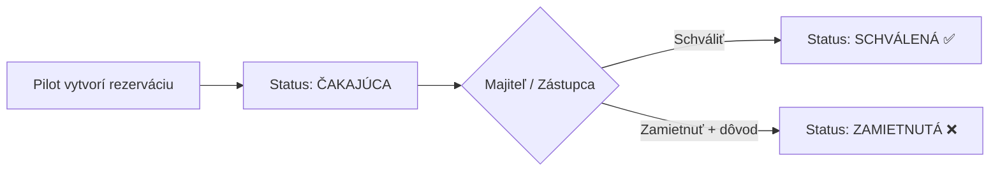

# Rezervačný Systém Lietadiel Špaček SD-1 / SD-2

Mobilná webová aplikácia (PWA-ready) na rezerváciu ultraľahkých lietadiel typu Špaček SD-1 Minisport a SD-2 SportMaster s kalendárovým systémom, VFR obmedzeniami a schvaľovacím workflow.

**Domovské letisko:** Holíč (LZHL) — 48.8103°N, 17.1338°E

## Navrhované Riešenie

Jednoduchá single-page mobilná webová aplikácia (HTML + CSS + vanilla JS) s dátami v `localStorage`. Prístup len pre prihlásených používateľov – nových používateľov musí schváliť admin. Aplikácia bude optimalizovaná na mobilné zariadenia s možnosťou pridania na plochu ako PWA.

---

## Štruktúra Aplikácie

### Obrazovky

| # | Obrazovka | Popis |
|---|-----------|-------|
| 1 | **Prihlásenie / Registrácia** | Login s PIN, registrácia nového účtu (vyžaduje schválenie adminom) |
| 2 | **Dashboard** | Prehľad flotily, nadchádzajúce rezervácie, rýchle akcie |
| 3 | **Výber lietadla** | Zoznam typov (SD-1, SD-2) → konkrétne registrácie |
| 4 | **Kalendár & Rezervácia** | Týždenný/denný kalendár s VFR oknami, tvorba rezervácie |
| 5 | **Moje rezervácie** | Zoznam mojich rezervácií so stavom (čakajúca / schválená / zamietnutá) |
| 6 | **Admin – Schvaľovanie** | Prehľad čakajúcich žiadostí na schválenie (pre majiteľa/zástupcu) |

### Navigácia
- Spodný tab-bar (mobilný štýl): Dashboard | Lietadlá | Moje rezervácie | (Admin)

---

## Dátový Model

### Lietadlá (hardcoded demo dáta)

```javascript
const fleet = [
  // SD-1 Minisport (jednomiestne)
  { id: 'sd1-1', type: 'SD-1', name: 'Špaček SD-1 Minisport', registration: 'OK-VUR', seats: 1, image: '...' },
  // SD-2 SportMaster (dvojmiestne)
  { id: 'sd2-1', type: 'SD-2', name: 'Špaček SD-2 SportMaster', registration: 'OK-BUR37', seats: 2, image: '...' },
  { id: 'sd2-2', type: 'SD-2', name: 'Špaček SD-2 SportMaster', registration: 'OK-UUR02', seats: 2, image: '...' },
];
// Admin môže pridávať nové lietadlá cez rozhranie
```

### Rezervácia

```javascript
{
  id: 'res-uuid',
  aircraftId: 'sd2-1',
  pilotId: 'user-1',
  pilotName: 'Ján Novák',
  dateFrom: '2026-08-10T06:30:00',
  dateTo: '2026-08-10T08:00:00',
  purpose: 'Výcvikový let',
  status: 'pending' | 'approved' | 'rejected',
  approvedBy: null | 'admin-1',
  createdAt: '2026-08-04T09:00:00',
  note: ''
}
```

### Používatelia (demo)

```javascript
const users = [
  { id: 'admin-1', name: 'Igor Špaček', role: 'owner', pin: '0000', approved: true },
  { id: 'admin-2', name: 'Mária Kováčová', role: 'deputy', pin: '9999', approved: true },
  // Piloti sa registrujú sami, ale musia byť schválení adminom
  { id: 'pilot-1', name: 'Ján Novák', role: 'pilot', pin: '1234', approved: true },
  { id: 'pilot-2', name: 'Peter Horváth', role: 'pilot', pin: '5678', approved: false }, // čaká na schválenie
];
// Neschválení používatelia sa nemôžu prihlásiť ani vytvárať rezervácie
```

---

## VFR Časové Obmedzenia

### Implementácia
- Použitie vstavaného algoritmu na výpočet **sunrise** a **sunset** pre danú lokalitu (Holíč LZHL – 48.8103°N, 17.1338°E)
- VFR okno: **30 minút pred sunrise → 30 minút po sunset** (občiansky súmrak)
- Kalendár vizuálne zobrazí:
  - 🟢 Zelená zóna = VFR lietateľné hodiny
  - 🔴 Červená/šedá zóna = noc (nelietateľné pre VFR)
- Používateľ **nemôže** vytvoriť rezerváciu mimo VFR okno
- Algoritmický výpočet sunrise/sunset podľa NOAA/USNO vzorcov (bez externých API)

### Validácia Rezervácie
- Minimálna dĺžka: **20 minút**
- Maximálna dĺžka: **bez pevného limitu** (môže byť viacdenná, ale kontrola VFR v každom dni)
- Kontrola kolízií s existujúcimi (schválenými) rezerváciami
- Celý rozsah rezervácie musí spadať do VFR okna

---

## Schvaľovací Workflow



- Admini (majiteľ + zástupca) vidia všetky čakajúce žiadosti
- Môžu schváliť alebo zamietnuť s poznámkou
- Pilot vidí stav svojich rezervácií v reálnom čase

### Schvaľovanie Používateľov
- Nový používateľ sa zaregistruje (meno, PIN)
- Admin musí schváliť nový účet → dovtedy sa používateľ nemôže prihlásiť
- Admin môže spravovať používateľov (schváliť / odobrať prístup)
- Admin obrazovka obsahuje aj správu lietadiel (pridanie nových imatrikulácií)

---

## Dizajnový Koncept

### Farebná Schéma
- **Primárna**: Vzdušná modrá (`#0ea5e9` → `#0284c7`) – evokuje oblohu
- **Sekundárna**: Sunset oranžová (`#f97316`) – evokuje letecký súmrak
- **Pozadie**: Tmavý mód (`#0f172a` → `#1e293b`) – profesionálny aviatický vzhľad
- **Úspech**: `#22c55e` (schválené)
- **Chyba/Zamietnuté**: `#ef4444`
- **Čakajúce**: `#eab308` (žltá)

### UI Prvky
- Glassmorphism karty pre lietadlá
- Plynulé animácie prechodu medzi obrazovkami
- Vlastný kalendár s farebnými VFR zónami
- Swipe gestá na mobilných zariadeniach
- Font: **Inter** (Google Fonts)
- Ikony: Inline SVG (bez externých knižníc)

---

## Súborová Štruktúra

```
C:\Users\skubamro\.gemini\antigravity\scratch\aircraft-booking\
├── index.html          # Hlavná HTML stránka
├── css/
│   └── styles.css      # Kompletný CSS (design system + komponenty)
├── js/
│   ├── app.js          # Hlavný kontrolér aplikácie, routing
│   ├── data.js         # Dátový model, flotila, používatelia
│   ├── calendar.js     # Kalendárový komponent
│   ├── vfr.js          # VFR sunrise/sunset výpočty
│   ├── booking.js      # Rezervačná logika
│   ├── auth.js         # Autentifikácia + registrácia + schvaľovanie užívateľov
│   └── admin.js        # Admin panel (schvaľovanie rezervácií, užívateľov, správa flotily)
└── manifest.json       # PWA manifest
```

---

## Vyriešené Otázky

- ✅ **Lokalita**: Holíč LZHL (48.8103°N, 17.1338°E)
- ✅ **Imatrikulácie**: SD-1: OK-VUR | SD-2: OK-BUR37, OK-UUR02 (+ možnosť pridávať)
- ✅ **Prístup**: Len pre schválených používateľov (admin schvaľuje registrácie)
- ✅ **Jazyk UI**: Slovenčina

---

## Verification Plan

### Manuálna Verifikácia
1. Otvorenie v prehliadači a test na mobilnom zariadení
2. Vytvorenie rezervácie v rámci VFR okna → overenie úspechu
3. Pokus o rezerváciu mimo VFR okna → overenie zamietnutia
4. Pokus o rezerváciu kratšiu ako 20 min → overenie chybovej hlášky
5. Kolízia rezervácií → overenie detekcie
6. Admin prihlásenie → schválenie a zamietnutie žiadosti
7. Kontrola responzivity na rôznych veľkostiach obrazovky
